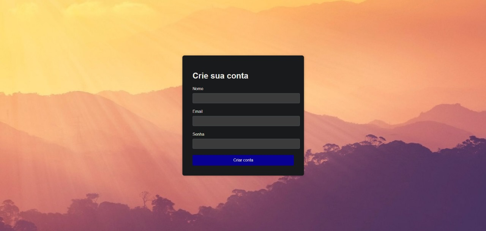

#  Formulário com Validação – Desafio HTML + CSS + JS

Projeto criado como parte de um desafio intermediário de HTML, CSS e JavaScript puro.

O objetivo foi desenvolver um formulário com validação manual, seguindo um layout proposto no Figma, onde:
- Campos obrigatórios não preenchidos são destacados;
- Mensagens de erro são exibidas dinamicamente;
- A interface visual é próxima de um projeto real.

---

##  Acesse o Projeto Online

URL -> https://erickao-120hzz.github.io/projeto-formulario-desafio/

 [Clique aqui para ver o projeto no GitHub Pages](https://erickcarvalho.github.io/projeto-formulario-desafio/)

---

##  Funcionalidades

-  Validação de campos obrigatórios (nome, email e senha);
-  Borda vermelha nos campos com erro;
-  Mensagem "*campo obrigatório*" abaixo do input;
-  Layout responsivo e com imagem de fundo;
-  HTML semântico, CSS organizado e JavaScript puro.

---

##  Layout do Desafio

 [Visualizar no Figma](https://www.figma.com/design/zBKnYG9UNdUiIr8ClQTWSG/DESAFIO---HTML-CSS-JS-INTERMEDI%C3%81RIO?node-id=3-2&p=f&t=yjZjXwCmeGF1Cj8N-0)

---

##  Tecnologias

- HTML5
- CSS3
- JavaScript (sem bibliotecas)
- Git & GitHub

---

##  Estrutura

projeto-formulario-desafio/
├── index.html
├── src/
│ ├── css/
│ │ └── style.css
│ ├── js/
│ │ └── script.js
│ └── imagens/
│ └── fundo.jpg

---

##  Preview

---

##  Autor

**Erick Carvalho**

 Me encontra no Discord: `@erickzdv.exe`  
 Instagram: [@erickzdv](https://instagram.com/erickzdv)

---

##  Observações

Este projeto não usa bibliotecas externas nem frameworks — todo o comportamento foi implementado com JavaScript puro, focando na prática da manipulação de DOM e validação manual de formulários.

---
